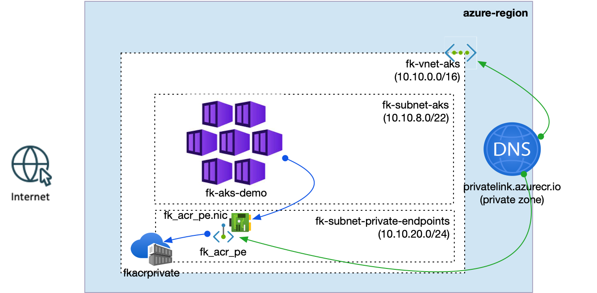
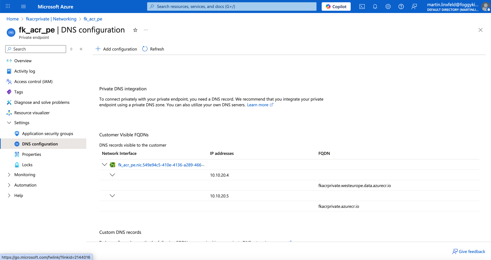
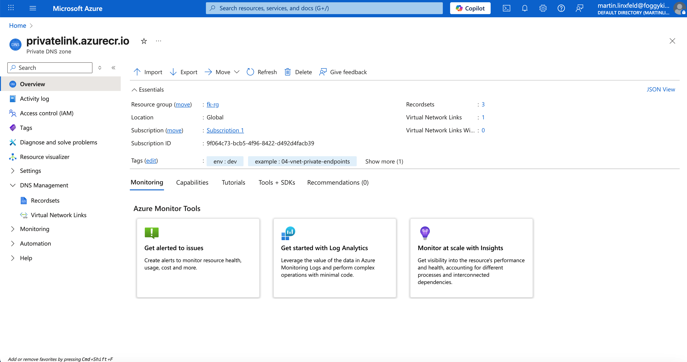
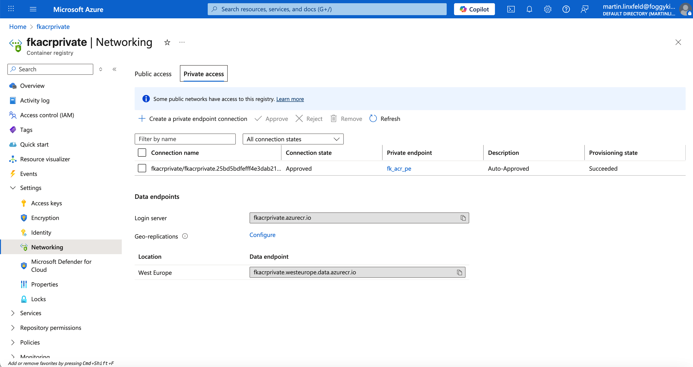

# Example 02: Private ACR with AKS and Private Endpoint

In this example, we deploy **AKS** into a private subnet and connect it to a
**private Azure Container Registry (ACR)** using a **Private Endpoint** and
**Private DNS**. The goal is a clean, private image‑pull path without exposing
ACR to the public internet.

This is a focused example that shows:
- how AKS resolves ACR privately via DNS,
- how Private Endpoint traffic stays on the Azure backbone,
- and how to keep ACR reachable only through the private endpoint.

---

## 🧭 Architecture Overview

This deployment creates:
- An **AKS cluster** via `terraform-az-fk-aks`
- A **Virtual Network** with two subnets via `terraform-az-fk-vnet`
  - `fk-subnet-aks` for AKS nodes
  - `fk-subnet-private-endpoints` for Private Endpoints
- An **Azure Container Registry (ACR)** (Premium SKU)
- A **Private Endpoint** for the ACR `registry` subresource via `terraform-az-fk-private-endpoint`
- A **Private DNS Zone** (`privatelink.azurecr.io`) with a VNet link



*Figure 1. AKS pulls images from ACR through a private endpoint and Private DNS.*

---

## 🔐 Private DNS Flow

Private DNS ensures the standard ACR FQDN resolves to the **private IP** of the endpoint:



*Figure 2. Private Endpoint DNS configuration for ACR.*



*Figure 3. Private DNS zone for `privatelink.azurecr.io`.*


*Figure 4. Private DNS zone linked to the AKS VNet.*


*Figure 5. Private DNS record set mapping ACR FQDN to the PE private IP.*

---

## 🚀 Deployment Steps

From the `examples/02_private_acr_with_aks_and_private_endpoint` directory:

```bash
tofu init
tofu plan
tofu apply
```

---

## 🖼️ Azure Portal View



*Figure 6. ACR with Private Endpoint and Private DNS integration.*

---

## 📤 Outputs

```bash
tofu output
```

- `acr_private_endpoint_ip` — private IP address assigned to the ACR Private Endpoint

---

## 🧹 Cleanup

```bash
tofu destroy
```

---

## 🪪 License

Licensed under the **Universal Permissive License (UPL), Version 1.0**.
